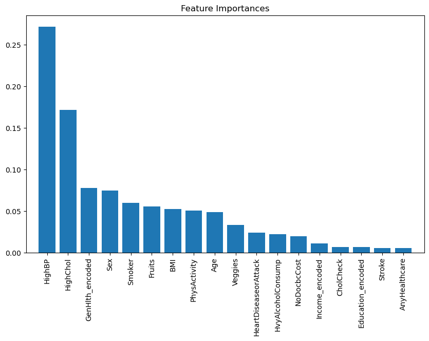
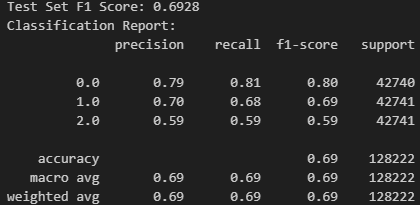

Data Science Final Project

Project/Goals/Hypothesis

The project aims to predict diabetes status (no diabetes, prediabetes, and diabetes) using machine learning algorithms. The primary goal is to understand how various features impact diabetes status and develop a predictive model to accurately estimate diabetes status based on these features.

My hypothesis is, among the features in the dataset, 'GenHlth', 'BMI', 'PhysActivity', 'HighBP', and 'Age' will have the most significant impact on predicting the presence of diabetes.

Process

Step 1: Data Collection and Preprocessing

Acquired diabetes dataset from Kaggle

Explored and cleaned the dataset to handle missing values, outliers, and inconsistencies.

Step 2: Exploratory Data Analysis

Conducted exploratory data analysis to understand the distribution and relationships between different features and the target variable (diabetes status).

Visualized key insights using plots and charts to identify patterns and correlations:

Step 3: Model Training and Evaluation

Split the data into training and testing sets.

Trained multiple machine learning models (e.g., logistic regression, SVM, gradient boosting, neural network, random forest) to predict diabetes status.

I originally went with Random Forest, but changed it to Gradient Boost after comparing it with other models.

Evaluated model performance using metrics such as F1 score, precision, recall, and classification report.

Results

Some predictions made by the Gradient Boosting model on the test dataset:

Class 0: precision 0.79, recall 0.81, f1-score 0.80, support 42740
Class 1: precision 0.70, recall 0.68, f1-score 0.69, support 42741
Class 2: precision 0.59, recall 0.59, f1-score 0.59, support 42741
Overall accuracy is 0.69, with macro and weighted averages of precision, recall, and F1-score also around 0.69.

Challenges

The dataset required extensive cleaning and preprocessing to handle missing values, outliers, and inconsistencies. This process was time-consuming and required careful consideration to ensure data quality.
Selecting the right model and hyperparameters.

Time constraints.

Deciding which metrics to use for model evaluation.

Future Goals

If more time were available, I would focus on the following tasks to enhance the project:

Feature Engineering:

Invest more time in feature engineering to extract additional insights from the dataset. It could involve creating new features, transforming existing ones, or incorporating external data sources to enrich the feature set.

Model Tuning and Ensemble Methods: 

I would conduct more extensive hyperparameter tuning for the machine learning models to improve their performance. Also, explore ensemble methods such as stacking or boosting to combine the strengths of multiple models for better prediction accuracy.