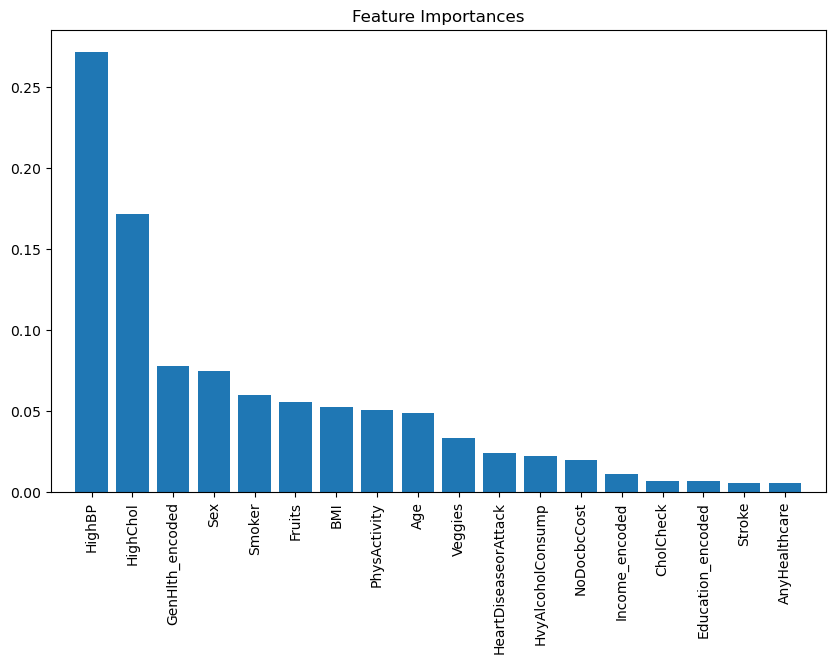
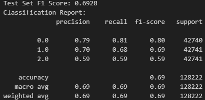

# Data Science Final Project: Diabetes Prediction

## Project Overview
Diabetes is a growing health concern worldwide, affecting millions of people. This project leverages machine learning to predict diabetes status (no diabetes, prediabetes, and diabetes) using health indicators, aiming to assist in early detection and prevention.

### **Goals & Hypothesis**
The primary goal is to develop a predictive model to estimate diabetes status based on various health indicators. 

**Hypothesis:** Among the dataset features, `GenHlth`, `BMI`, `PhysActivity`, `HighBP`, and `Age` will have the most significant impact on predicting diabetes.

---
## **Process**

### 1️⃣ **Data Collection & Preprocessing**
- Acquired diabetes dataset from Kaggle.
- Cleaned the dataset, handling missing values, outliers, and inconsistencies.
- Applied feature encoding and scaling to ensure data was machine-learning ready.

### 2️⃣ **Exploratory Data Analysis (EDA)**
- Analyzed feature distributions and relationships using **visualizations**.
- Identified correlations between features and the target variable.

**Example Insights:**

### 3️⃣ **Model Training & Selection**
- Split data into **training and testing sets**.
- Trained multiple models: **Logistic Regression, SVM, Gradient Boosting, Neural Networks, Random Forest**.
- Compared performance using **F1 score, precision, recall, and classification reports**.
- **Final choice:** Gradient Boosting due to its superior handling of imbalanced classes and feature interactions.

---
## **Results**
### **Final Model Performance (Gradient Boosting)**
| Class | Precision | Recall | F1 Score | Support |
|-------|----------|--------|----------|---------|
| **0** | 0.79 | 0.81 | 0.80 | 42,740 |
| **1** | 0.70 | 0.68 | 0.69 | 42,741 |
| **2** | 0.59 | 0.59 | 0.59 | 42,741 |
| **Overall Accuracy** | | | **0.69** | |

🔹 **Key Takeaway:** The model performs well, especially for **Class 0 and Class 1**, but could be further improved for **Class 2**.

---
## 🛠️ **Challenges & Lessons Learned**
- **Data Cleaning:** Required extensive handling of missing values and outliers, reinforcing the importance of preprocessing.
- **Model Selection:** Comparing multiple models helped me understand the trade-offs between accuracy, interpretability, and training time.
- **Hyperparameter Tuning:** Implementing **GridSearchCV & RandomizedSearchCV** significantly improved performance.

---
## **Future Enhancements**
- **Feature Engineering:** Explore additional transformations and external data sources to improve predictions.
- **Advanced Model Tuning:** Use ensemble methods like **Stacking or Boosting** to improve accuracy.
- **Deployment:** Build an interactive web app to make real-time predictions.

---
### **Final Thoughts**
This project deepened my understanding of **machine learning pipelines, feature selection, model tuning, and real-world ML challenges**. I'm excited to continue refining and expanding this work! 
